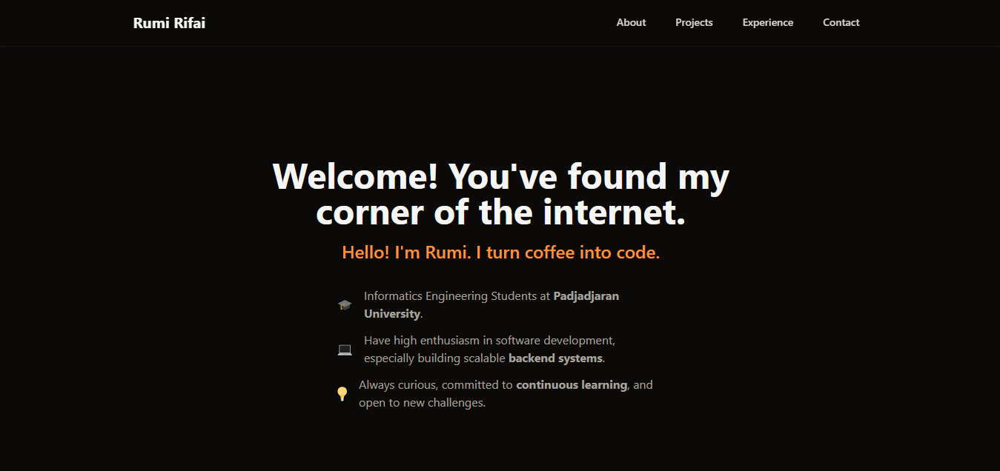

# My Personal Portfolio Website

This repository hosts the source code for my personal portfolio website, designed and built by me from the ground up. This site acts as my digital resume and a showcase for my projects, skills, and professional journey in software development, with a focus on backend engineering.

[](https://rumirifai.github.io)



## About This Project

The primary goal of this project was to create a clean, fast, and responsive single-page application to serve as a central hub for my professional identity. It details my work experience, personal projects, and technical competencies.

The entire site was developed with a mobile-first approach, ensuring a seamless experience across all devices, and features a custom "coffee" dark mode theme for comfortable viewing.

## 🛠️ Tech Stack

This portfolio was built using a modern, component-based architecture. The main technologies and tools used are:


## 🚀 Running Locally

To run this project on your local machine, follow these steps:

1.  **Clone the repository**
    ```bash
    git clone [https://github.com/rumirifai/rumirifai.github.io.git](https://github.com/rumirifai/rumirifai.github.io.git)
    ```

2.  **Navigate to the project directory**
    ```bash
    cd rumirifai.github.io
    ```

3.  **Install dependencies**
    ```bash
    npm install
    ```

4.  **Start the development server**
    ```bash
    npm run dev
    ```
    Open `http://localhost:5173` in your browser.

## Acknowledgements

Thank you for visiting. This project was a great learning experience in modern frontend development and deployment automation.